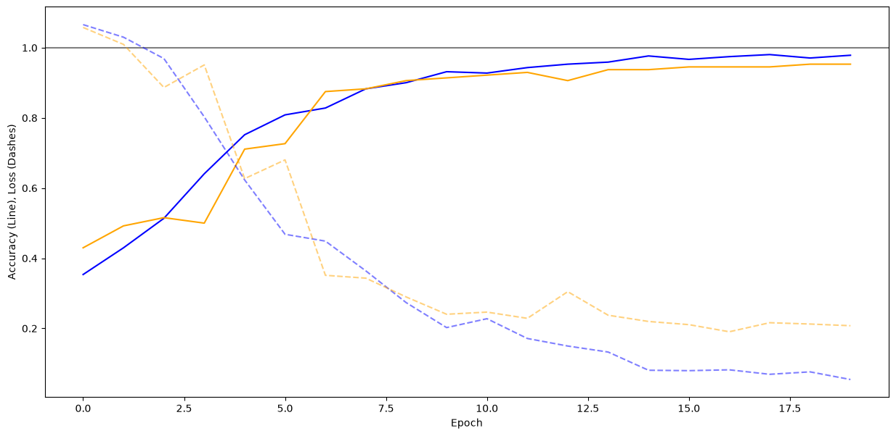
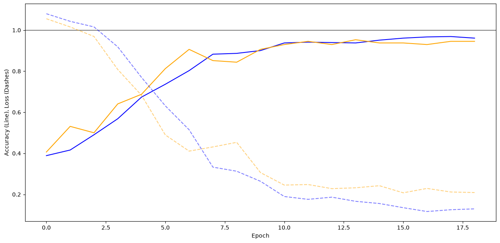
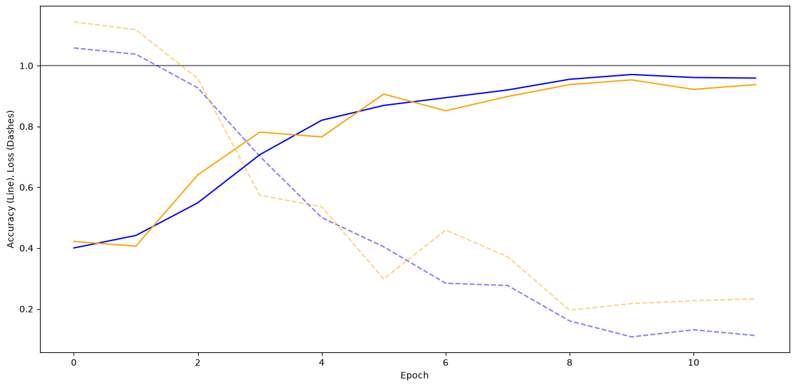
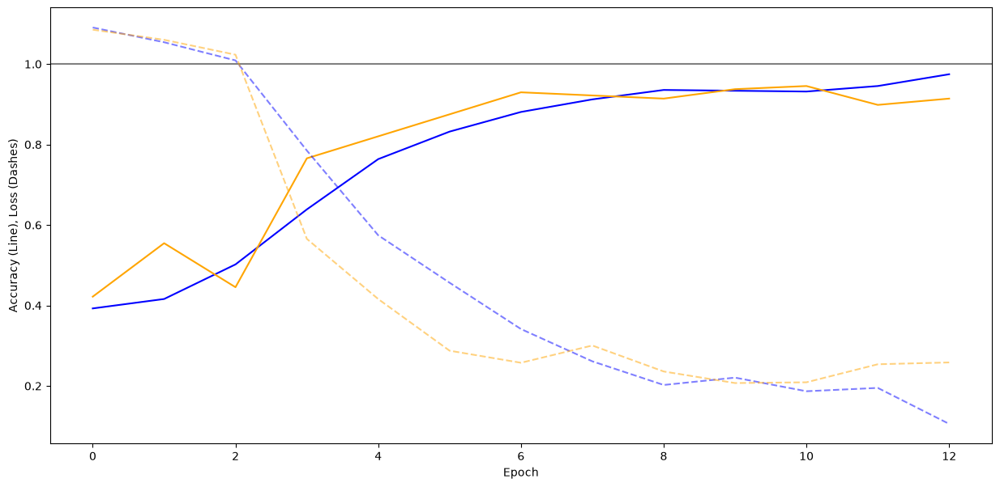
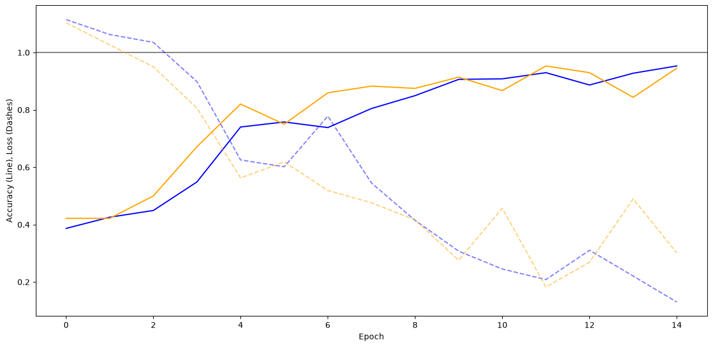

## Scale factor for number of conv filters

The scale factor for the number of conv filters controls the size of the resulting CNN model.
By scaling the number of conv filters up, the model will get larger and be able to learn
complexer patterns.

### Assumption

Following the used values and assumptions on the behavior of the models:

**Baseline 1.0x: (64, 32, 32)**

- **0.25x Scale Factor:** Short training time, potentially underfitting, lowest accuracy, blazingly fast inference time
- **0.50x Scale Factor:** Moderate training time, potentially underfitting, low accuracy, fast inference time
- **2.00x Scale Factor:** Long training time, potentially overfitting, high accuracy, slow inference time
- **4.00x Scale Factor:** Longer training time, likely overfitting, accuracy might improve slightly or worsen, extremly slow inference time

### Results

#### 0.25x Scale Factor

#### 0.50x Scale Factor

#### 1.00x Scale Factor

#### 2.00x Scale Factor

#### 4.00x Scale Factor

### Findings

After training the different models, it became clear that the underlying assumptions were mostly correct.
By scaling the number of conv fliters the models did either get less capable (smaller) or more capable (larger).
The training and inference time correlated with the size of the model and the resulting accuracy (mostly) as expected.
The only "outlier" for accuracy was at 4.00x Scale Factor, which is probably due to overfitting/learning complexer, unrelated patterns,
that we were not interested in.